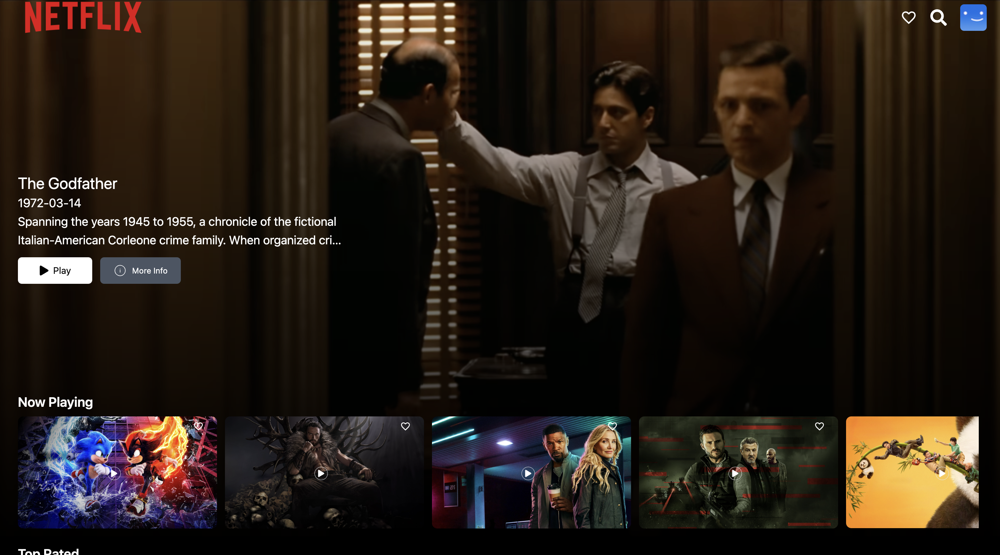
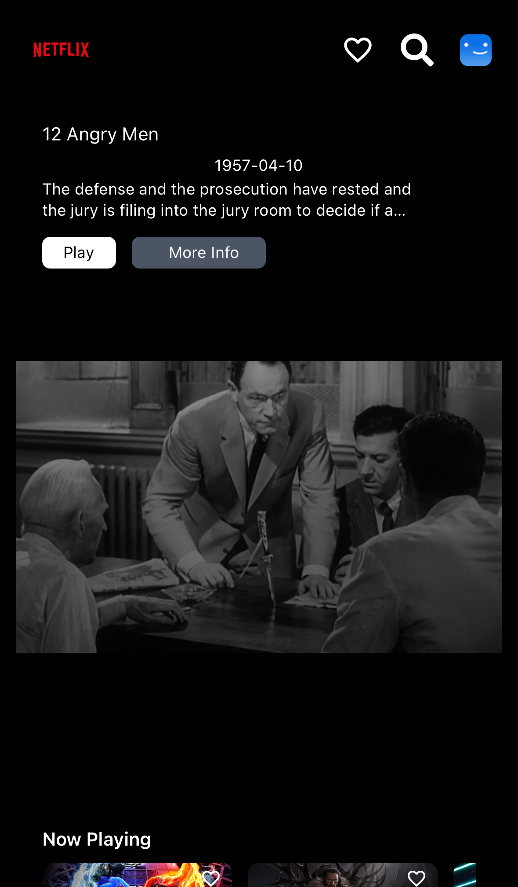

<h2 align="center">
  Portfolio Website - v 1.0<br/>
</h2>
<div align="center">
  
  
  
</div>
<a href="https://sayarvideoclone.netlify.app/" target="_blank">Demo</a>
<br/>
<br/>

>Created a basic netflix like clone using react and state.
>Sign in and Sign up using firebase
>Option to login via google sign in
>Movie search page
>Add to favorites from redux
>Using react modal to show movie details
>Using react player to show the clip or trailer of the movie


## Installation

Use the package manager [npm](https://docs.npmjs.com/cli/v8/commands/npm-install) to install npm.

```bash
clone this repository -> git clone https://github.com/sayarsamanta/sayar_netflix_clone.git
navigate to project directory -> cd my-portfolio
install npm -> npm install i
```

[](https://forthebadge.com) &nbsp;
[](https://forthebadge.com) &nbsp;
[](https://forthebadge.com) &nbsp;
## Built with
 - React JS.
 - Tailwind CSS.
 - Context API.
 - VS Code.
 - Redux
 - Google Sign in
 - Firebase authentication

## Usage and Instructions
- Open the project folder and Navigate to `/src`.
- All the required components is located inside this folder.
- To run this in your local we need the client id, access token, tmdb api key
- We need to change the firebaseConfig inside the src/utils directory

## Contributing

Pull requests are welcome. For major changes, please open an issue first
to discuss what you would like to change.

Please make sure to update tests as appropriate.

## License

[MIT](https://choosealicense.com/licenses/mit/)
